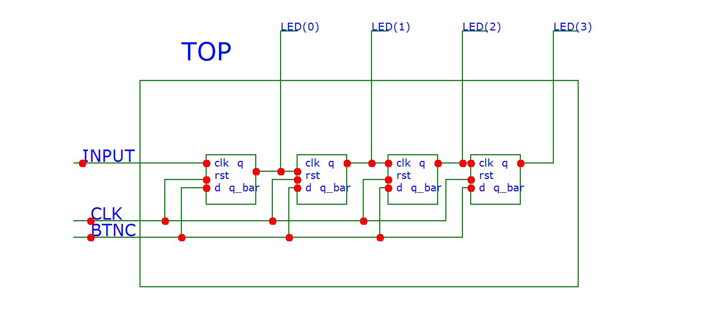

# Lab 5: INSERT_YOUR_FIRSTNAME INSERT_YOUR_LASTNAME

### D & T Flip-flops

1. Screenshot with simulated time waveforms. Try to simulate both D- and T-type flip-flops in a single testbench with a maximum duration of 350 ns, including reset. Always display all inputs and outputs (display the inputs at the top of the image, the outputs below them) at the appropriate time scale!

   

### JK Flip-flop

1. Listing of VHDL architecture for JK-type flip-flop. Always use syntax highlighting, meaningful comments, and follow VHDL guidelines:

```vhdl
architecture behavioral of jk_ff_rst is

   architecture Behavioral of t_ff_rst is
    signal s_q : std_logic;
      begin
      p_t_ff_rst : process(clk)
       begin
            if(rst = '1') then
                s_q <= '0';
            elsif (t = '0') then
                s_q <= s_q;
            else
                s_q <= not s_q;
            end if;  
    end process p_t_ff_rst;

    -- Output ports are permanently connected to local signal
    q     <= sig_q;
    q_bar <= not sig_q;
end architecture behavioral;
```

### Shift register

1. Image of `top` level schematic of the 4-bit shift register. Use four D-type flip-flops and connect them properly. The image can be drawn on a computer or by hand. Always name all inputs, outputs, components and internal signals!

   
