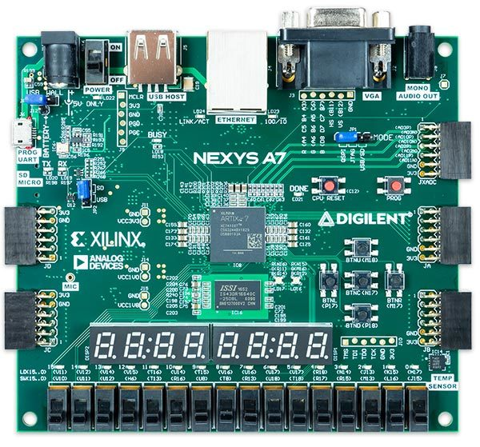
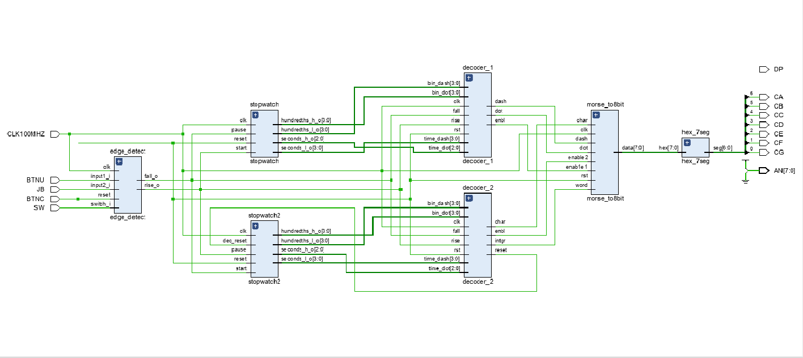
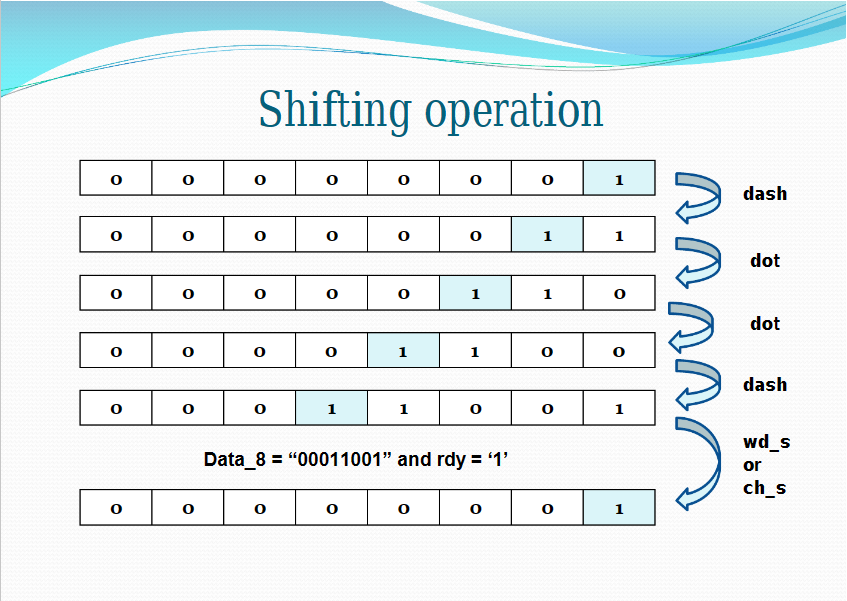
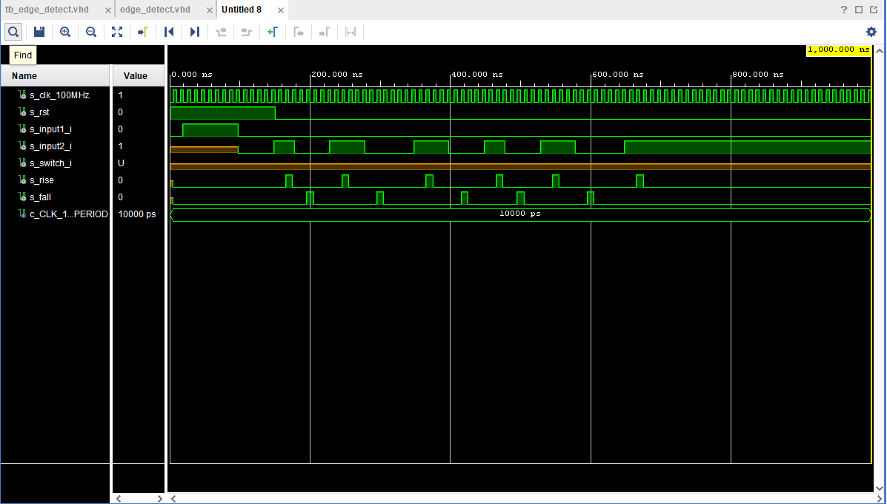

# VHDL project - Morse Code Receiver

### Team members

* Lysá Barbora (responsible for edge_detect,d_ff_rst, hex_7_seg and implementation)
* Shishkova Viktoriia (responsible for decoders, stopwatches, git descriprion)
* Nguyen Nhat Truong (responsible for Top, testbenches and simulatioons)

## Theoretical description and explanation

The problem of this project is creating of Morse Code Receiver. Algorithm is simple: you should press the button and depending on pressing time the signal is recognised as dot or dash. After assembly all symbols we have the final letter or digit which is translated on the 7-segment display. The code is created such as "new-era" digital telegraph based on desk Nexys-A7-50T. 

We solved it with references on previous excersises and took some part of it from our previous solutions (for example clock_enable). Also we made new simulation sources to detect hashes and dots by pressing the BTNC-button. 

## Hardware description of demo application

Two buttons are used: 
- BTNC - for sending signals;
- BTNR - for reset of the memory.

## Software description

[Link to all sources file.](projekt_vhdl/fin_projekt/projekt_1.srcs) 

### Component(s) simulation

The main algorithm of morse_to8bit:

* Consists of falling_edge and rising_edge detecters, as result we have 0 or 1.

* Stopwatch_1 and Stopwatch_2 control time between rise and fall. For the first we have result 1, for the second one result is 0.
* Time

## Instructions

Write an instruction manual for your application, including photos or a link to a video.

## References

1. [Morse code (Wiki)](https://en.wikipedia.org/wiki/Morse_code)
2. [Morse code decoder design in VHDL](https://www.researchgate.net/publication/305379385_Morse_code_decoder_design_in_VHDL_using_FPGA_Spartan_3E_development_kit)
3. [Nexys A7 Reference Manual](https://digilent.com/reference/programmable-logic/nexys-a7/reference-manual)
